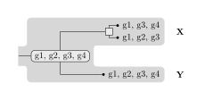
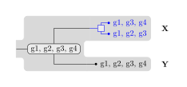

# superrec2

**superrec2** is a software package enabling researchers to run and compare algorithms for [phylogenetic reconciliation](https://en.wikipedia.org/wiki/Phylogenetic_reconciliation) and super-reconciliation.

## Installation

*superrec2* can be installed through `pip`.
Python ⩾3.11 is required.

```console
$ pip install superrec2
```

<details>
<summary>Installing from Git (for development)</summary>

You first need to [install Hatch](https://hatch.pypa.io/latest/install/), which is used by superrec2 to manage virtual environments and to build and publish packages.

Then clone the repository and use Hatch to install dependencies and start a development shell.

```console
$ git clone https://github.com/UdeM-LBIT/superrec2
$ cd superrec2
$ hatch shell
```

The following commands are useful for development.
You should make sure to pass unit tests and to reformat and lint the code before committing to the main branch.

Command | Task
------- | ----
`hatch run dev:test` | Run all unit tests
`hatch run dev:lint` | Check the code using [Ruff](https://beta.ruff.rs)
`hatch run dev:format` | Reformat the code using [Black](https://black.readthedocs.io/en/stable)
`hatch build` | Build distributable packages
`hatch publish` | Publish distributable packages to [PyPI](https://pypi.org/)
</details>

## Usage

### Preparing the input

To submit a reconciliation problem to one of the algorithms of this package, the first step is to prepare an input file containing the desired set of species, genes (or syntenies), and their phylogenetic trees.
Input files are JSON objects containing the following keys:

* `object_tree`: Newick string specifying the gene or synteny tree (if ancestral nodes are unnamed, they will be automatically named `O#` with indices increasing in pre-order),
* `species_tree`: Newick string specifying the species tree (if ancestral nodes are unnamed, they will be automatically named `S#` with indices increasing in pre-order),
* `leaf_object_species`: dictionary associating each leaf of the gene (or synteny) tree to its corresponding leaf species in the species tree.
* `leaf_syntenies` (optional, only for super-reconciliations): dictionary associating each leaf of the synteny tree to its corresponding synteny, specified as an array of genes.

Below is an example input for some fictional species and syntenies:

```json
{
    "object_tree": "((x_1,x_2),y_1);",
    "species_tree": "(X,Y);",
    "leaf_object_species": {
        "x_1": "X", "x_2": "X", "y_1": "Y"
    },
    "leaf_syntenies": {
        "x_1": ["g1", "g2", "g3"],
        "x_2": ["g1", "g3", "g4"],
        "y_1": ["g1", "g2", "g3", "g4"]
    }
}
```

A [complete input example including some Class-1 CRISPR-Cas systems](data/crispr-class1.in.json) is also available.
(This is the input used for the RECOMB-CG 2022 publication.)

### Running reconciliation algorithms

To run a reconciliation algorithm on a given input file, use the `superrec2 reconcile` command.
The basic usage of the command is as follows:

```console
$ superrec2 reconcile --input data/example.in.json --output example.out.json superdtl
Multifurcation resolutions: 100%|##########################################| 1/1 [00:00<00:00, 285.91it/s]
Minimum cost: 2
```

The `--input` flag specifies the path to the *input file*, and the `--output` flag specifies where to write the results.
The last argument is used to select the *reconciliation algorithm*, in this example `superdtl` (run `superrec2 reconcile --help` to see a list of available algorithms).
The program prints out the minimum cost of a solution and writes one of the solutions to the output file, which now contains the following object (edited for readability):

```json
{
    "input": {
        "object_tree": "((x_1,x_2)O1,y_1)O0;",
        "species_tree": "(X,Y)S0;",
        "leaf_object_species": { (repeated from above) },
        "costs": {
            "SPECIATION": 0, "DUPLICATION": 1, "HORIZONTAL_TRANSFER": 1,
            "FULL_LOSS": 1, "SEGMENTAL_LOSS": 1
        },
        "leaf_syntenies": { (repeated from above) }
    },
    "object_species": {
        "O0": "S0", "O1": "X", "x_1": "X", "x_2": "X", "y_1": "Y"
    },
    "syntenies": {
        "O0": ["g1", "g2", "g3", "g4"],
        "O1": ["g1", "g2", "g3", "g4"],
        "x_1": ["g1", "g2", "g3"],
        "x_2": ["g1", "g3", "g4"],
        "y_1": ["g1", "g2", "g3", "g4"]
    },
    "ordered": false
}
```

Of particular interest are the `object_species` key, which contains the computed reconciliation (mapping of synteny tree nodes to species tree nodes), and the `syntenies` key, which contains the labeling of synteny tree nodes with syntenic content.

Additional options are available to generate all possible solutions and set the individual event costs (for compatible algorithms); please run `superrec2 reconcile --help` for details.

### Generating reconciliation diagrams

#### From a solution

The `superrec2 draw` command can be used to visualize and inspect solutions generated by reconciliation algorithms.
The basic usage of the command is as follows:

```console
$ superrec2 draw --input example.out.json --output example.out.pdf
```

This generates the following diagram, representing the reconciliation result:



#### From manual input

The `superrec2 draw` program can also be used to plot _any reconciliation_, not just one generated by a reconciliation algorithm.
To that end, you need to create a JSON-formatted description of the reconciliation you are interested in plotting, for example:

```json
{
    "input": {
        "object_tree": "((x_1,x_2)O1,y_1)O0;",
        "species_tree": "(X,Y)S0;"
    },
    "object_species": {
        "O0": "S0", "O1": "X", "x_1": "X", "x_2": "X", "y_1": "Y"
    },
    "syntenies": {
        "O0": ["g1", "g2", "g3", "g4"],
        "O1": ["g1", "g2", "g3", "g4"],
        "x_1": ["g1", "g2", "g3"],
        "x_2": ["g1", "g3", "g4"],
        "y_1": ["g1", "g2", "g3", "g4"]
    }
}
```

This will generate the same diagram as in the previous section. Notice that some parts are omitted compared to the previous JSON document: this is because this one is only for drawing and does not result from a reconciliation computation.

#### Adding color

If you need to distinguish parts of the object tree in the generated diagram, you can add color to a subtree by specifying the `color` attribute on its root node.

```diff
 {
     "input": {
-       "object_tree": "((x_1,x_2)O1,y_1)O0;",
+       "object_tree": "((x_1,x_2)O1[&&NHX:color=0000FF],y_1)O0;",
        "species_tree": "(X,Y)S0;"
     },
     "object_species": {
         "O0": "S0", "O1": "X", "x_1": "X", "x_2": "X", "y_1": "Y"
     },
     "syntenies": {
         "O0": ["g1", "g2", "g3", "g4"],
         "O1": ["g1", "g2", "g3", "g4"],
         "x_1": ["g1", "g2", "g3"],
         "x_2": ["g1", "g3", "g4"],
         "y_1": ["g1", "g2", "g3", "g4"]
     }
 }
```

The input above will add a blue coloring to the subtree that undergoes a duplication event.



## References

* M. Goodman, J. Czelusniak, G. W. Moore, A. E. Romero-Herrera, and G. Matsuda, “Fitting the gene lineage into its species lineage, a parsimony strategy illustrated by cladograms constructed from globin sequences,” Systematic Biology, vol. 28, Art. no. 2, 1979-06, doi: [10.1093/sysbio/28.2.132](https://doi.org/10.1093/sysbio/28.2.132).
* A. Tofigh, M. Hallett, and J. Lagergren, “Simultaneous identification of duplications and lateral gene transfers,” IEEE/ACM Transactions on Computational Biology and Bioinformatics, vol. 8, Art. no. 2, 2011-03, doi: [10.1109/tcbb.2010.14](https://doi.org/10.1109/tcbb.2010.14).
* M. S. Bansal, E. J. Alm, and M. Kellis, “Efficient algorithms for the reconciliation problem with gene duplication, horizontal transfer and loss,” Bioinformatics, vol. 28, Art. no. 12, 2012-06, doi: [10.1093/bioinformatics/bts225](https://doi.org/10.1093/bioinformatics/bts225).
* M. Delabre, N. El-Mabrouk, K. T. Huber, M. Lafond, V. Moulton, E. Noutahi, and M. S. Castellanos, “Evolution through segmental duplications and losses: a super-reconciliation approach,” Algorithms for Molecular Biology, vol. 15, Art. no. 12, 2020-05, doi: [10.1186/s13015-020-00171-4](https://doi.org/10.1186/s13015-020-00171-4).
* Y. Anselmetti, M. Delabre, and N. El-Mabrouk, “Reconciliation with Segmental Duplication, Transfer, Loss and Gain,” RECOMB-CG 2022, Lecture Notes in Computer Science, vol. 13234, 2022-06, doi: [10.1007/978-3-031-06220-9_8](https://doi.org/10.1007/978-3-031-06220-9_8).
