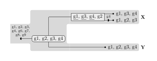

# superrec2

**superrec2** is a software package enabling researchers to run and compare algorithms for [phylogenetic reconciliation](https://en.wikipedia.org/wiki/Phylogenetic_reconciliation) and super-reconciliation.

## Installation

*superrec2* can be installed through `pip`.
Python ⩾3.11 is required.

```console
$ pip install superrec2
```

<details>
<summary>Installing from Git (for development)</summary>

You first need to [install Hatch](https://hatch.pypa.io/latest/install/), which is used by superrec2 to manage virtual environments and to build and publish packages.

Then clone the repository and use Hatch to install dependencies and start a development shell.

```console
$ git clone https://github.com/UdeM-LBIT/superrec2
$ cd superrec2
$ hatch shell
```

The following commands are useful for development.
You should make sure to pass unit tests and to reformat and lint the code before committing to the main branch.

Command | Task
------- | ----
`hatch run dev:test` | Run all unit tests
`hatch run dev:lint` | Check the code using [Ruff](https://beta.ruff.rs)
`hatch run dev:format` | Reformat the code using [Black](https://black.readthedocs.io/en/stable)
`hatch build` | Build distributable packages
`hatch publish` | Publish distributable packages to [PyPI](https://pypi.org/)
</details>

## Usage

### Preparing the input

To submit a reconciliation problem to one of the algorithms of this package, the first step is to prepare an input file containing the two trees to reconcile.
Input files are JSON objects containing NHX-formatted trees:

* `host_tree`: Tree of hosts (e.g., species) inside which the associates evolve. All internal nodes and leaves must be named.
* `associate_tree`: Tree of associates (e.g., genes or syntenies) evolving inside the host tree. Each leaf can have the following attributes:
    - `host` (required): Name of the host containing the associate.
    - `contents` (optional): Set of elements contained in the associate (e.g., genes inside a synteny).

Below is an example input for some fictional species and syntenies:

```json
{
    "host_tree": "(X,Y)XY;",
    "associate_tree": "(('x_1'[&host=X,contents='{''g1'',''g2'',''g3''}'],'x_2'[&host=X,contents='{''g1'',''g3'',''g4''}']),'y_1'[&host=Y,contents='{''g1'',''g2'',''g3'',''g4''}']);"
}
```

A [complete input example including some Class-1 CRISPR-Cas systems](data/crispr-class1.in.json) is also available.
(This is the input used for the RECOMB-CG 2022 publication.)

### Running reconciliation algorithms

To run a reconciliation algorithm on a given input file, use the `superrec2 reconcile` command.
The basic usage of the command is as follows:

```console
$ superrec2 reconcile --input data/minimal.in.json --output minimal.out.json
```

The `--input` flag specifies the path to the *input file*, and the `--output` flag specifies where to write the results.
By default, the program prints out the minimum cost of a solution, the number of co-optimal solutions, and writes one of these solutions to the output file.

```json
cost=2
count=2
{"host_tree": "(X,Y)XY;", "event_tree": "(((('x_1'[&contents='{''g3'', ''g2'', ''g1''}',host=X,kind=extant])[&contents='{''g3'', ''g2'', ''g4'', ''g1''}',host=X,kind=loss,segment='{''g4''}'],'x_2'[&contents='{''g3'', ''g4'', ''g1''}',host=X,kind=extant])[&contents='{''g3'', ''g1'', ''g4'', ''g2''}',host=X,kind=diverge,result=1,segment='{''g3'', ''g4'', ''g1''}'],'y_1'[&contents='{''g3'', ''g2'', ''g4'', ''g1''}',host=Y,kind=extant])[&contents='{''g3'', ''g1'', ''g4'', ''g2''}',host=XY,kind=codiverge])[&contents='set()',gained='{''g3'', ''g1'', ''g4'', ''g2''}',host=XY,kind=gain];"}
```

The output file contains the original host tree, along with an “event tree”.
This tree is an extension of the associate tree with additional nodes and attributes on the nodes:

- `kind`: Event kind.
- `gained` (for `kind=gain`): Set of gained elements.
- `segment` (for `kind=loss` or `kind=diverge`): Set of elements affected by the event.
- `transfer` (for `kind=diverge`): Whether the divergence is a horizontal transfer or not (default: false).
- `cut` (for `kind=diverge`): Whether the divergence is a fission or a duplication (default: false).
- `host`: Name of the inferred host containing the event.
- `contents`: Set of elements contained in the associate (e.g., genes inside a synteny).

To change what kind of solutions are computed, use the `--method` flag.
For example `--method all-solutions` will output all co-optimal solutions.

### Generating reconciliation diagrams

The `superrec2 draw` command can be used to visualize and inspect solutions generated by reconciliation algorithms.
The basic usage of the command is as follows:

```console
$ superrec2 draw --input minimal.out.json --output minimal.out.pdf
```

This generates the following diagram, representing the reconciliation result:



## References

* M. Goodman, J. Czelusniak, G. W. Moore, A. E. Romero-Herrera, and G. Matsuda, “Fitting the gene lineage into its species lineage, a parsimony strategy illustrated by cladograms constructed from globin sequences,” Systematic Biology, vol. 28, Art. no. 2, 1979-06, doi: [10.1093/sysbio/28.2.132](https://doi.org/10.1093/sysbio/28.2.132).
* A. Tofigh, M. Hallett, and J. Lagergren, “Simultaneous identification of duplications and lateral gene transfers,” IEEE/ACM Transactions on Computational Biology and Bioinformatics, vol. 8, Art. no. 2, 2011-03, doi: [10.1109/tcbb.2010.14](https://doi.org/10.1109/tcbb.2010.14).
* M. S. Bansal, E. J. Alm, and M. Kellis, “Efficient algorithms for the reconciliation problem with gene duplication, horizontal transfer and loss,” Bioinformatics, vol. 28, Art. no. 12, 2012-06, doi: [10.1093/bioinformatics/bts225](https://doi.org/10.1093/bioinformatics/bts225).
* M. Delabre, N. El-Mabrouk, K. T. Huber, M. Lafond, V. Moulton, E. Noutahi, and M. S. Castellanos, “Evolution through segmental duplications and losses: a super-reconciliation approach,” Algorithms for Molecular Biology, vol. 15, Art. no. 12, 2020-05, doi: [10.1186/s13015-020-00171-4](https://doi.org/10.1186/s13015-020-00171-4).
* Y. Anselmetti, M. Delabre, and N. El-Mabrouk, “Reconciliation with Segmental Duplication, Transfer, Loss and Gain,” RECOMB-CG 2022, Lecture Notes in Computer Science, vol. 13234, 2022-06, doi: [10.1007/978-3-031-06220-9_8](https://doi.org/10.1007/978-3-031-06220-9_8).
